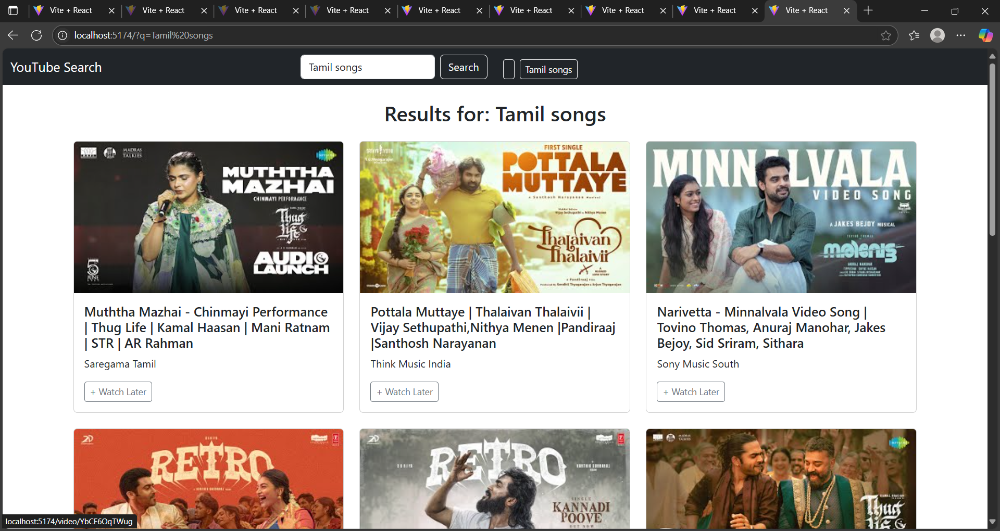

<<<<<<< HEAD
# YouTube Explorer 🎥

A simple React + Bootstrap app to search YouTube videos, view details, and save videos for later.

## Features 🚀
- Search videos via YouTube Data API
- View thumbnails, titles, views, likes
- "Watch Later" feature using localStorage
- Responsive UI with React-Bootstrap

## Tech Stack 🛠️
- React + Vite
- React Router DOM
- React Bootstrap
- Axios
- YouTube Data API v3

## How to Run Locally
1. Clone the repo
2. Run `npm install`
3. Create `.env` with `VITE_YOUTUBE_API_KEY=YOUR_API_KEY`
4. Run `npm run dev`
=======
## 📸 Demo

### App Screenshot:
<<<<<<< HEAD

>>>>>>> b0e5801 (Added app screenshot and updated README)
=======

>>>>>>> 6bfa990 (Fixed README screenshot link)
